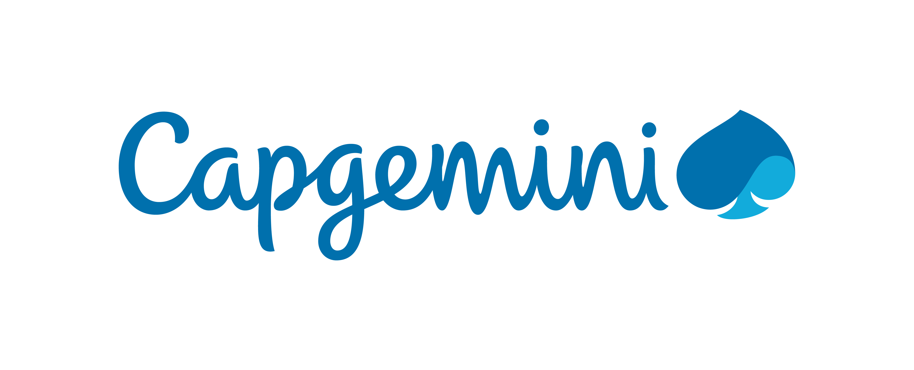

# Capgemini AI Workshop / Crime Detection with YOLO

Welcome to our AI Workshop with YOLO. We hope will have some possibilities to learn something new and also have fun. The Workshop is structured that you will have several task to solve. There is a warm up task and then each task has a given scenario which guides you to the task and helps to understand what we want you to solve.

Each task has it's dataset, which you easily can download and work with.

### The Scope

In general the workshop is about Object Detection. The provided dataset contains surveillance camera snapshots from shopping mall. Mainly the images contains a crowd of people and everything else visible in a corridor between different shops like a bank where people sit and everything related. Now, the idea is in general for each task to find a suspicious person which cold be the thief. 

Example Image: 

### Get Started

We will now present the task description and a prepared colab notebook. For the coding part `python` knowledge is required. The colabs are prepared so that you only would need to do a small part to solve the task. But this is of course the main part. Data loading + preparation has been done by us, as you will see.

The last task will be the hardest. You will be asked to fine tune an own YOLO model. The dataset is prepared as data labeling takes enormous time. More details can be found in the specific Colab notebook.

*To get started:* Please open the colabs and save it in your account so that your changes will be saved actually.

### Exercises

1. #### Get to know Yolov3
Before we start identifying the thieves, in this task we deal with everything around Yolov3. This tool is enormously helpful to identify elements in an image like persons. Pre-trained models already provide the ability to identify people. In the last task we will see that it is also possible to adapt the existing models to the use case. In order to understand and use Yolov3, we can now examine the created crops, the list of all identified classes and the bounding boxes of an object.

*(The YOLO Architeture as we know it from the presentation)*

Colab: https://github.com/bees4ever/ai-workshop-2022/blob/main/colabs/YOLO_Workshop_Capgemini_2022_Exercise_00.ipynb

2. #### Burglary at night in a shopping mall
There was a burglary at night in the shopping center. There were no other people in the building at the time of the burglary. A surveillance camera recorded images of the shopping mall. Your task is to automatically scan the images from the surveillance camera and mark the people who are alone in the mall as suspicious.
To do this, count the number of people per image and plot a time graph to analyze the mall's occupancy. Extract the images of the people who were alone in the mall.

Colab: https://github.com/bees4ever/ai-workshop-2022/blob/main/colabs/YOLO_Workshop_Capgemini_2022_Exercise_01_ready.ipynb

3. #### Spies in the shopping mall 
According to the intelligence service, there was a spy in the shopping center during regular opening hours. This spy was conspicuously dressed. You are to automatically analyze the images of the surveillance camera for conspicuously dressed persons. The image of the suspicious person is to be handed over to the intelligence service.
To do this, create the crops of all the people and then extract the three most common colors in the image. If a conspicuous color occurs frequently, it is a suspicious person.

Colab: https://github.com/bees4ever/ai-workshop-2022/blob/main/colabs/YOLO_Workshop_Capgemini_2022_Exercise_02_ready.ipynb

4. #### Cyber attack on the surveillance system
Over the weekend, there was an attack on the surveillance system to break into the shopping center. The police found traces of burglary. So far, it has not been determined if anything was stolen.
Check if there was a failure of the surveillance camera. In this case, the image freezes. Analyze automatically whether there were any conspicuous persons in the building before or after the failure.

Colab: https://github.com/bees4ever/ai-workshop-2022/blob/main/colabs/YOLO_Workshop_Capgemini_2022_Exercise_03_ready.ipynb

5. #### Theft of a branded teddy bear
A valuable teddy bear was stolen from the shopping mall. Witnesses have seen the thief with the teddy bear in his arms. Your task is to search the surveillance camera images in an automated way to hand over a picture of the person to the police.
To do this, extract all the crops with a teddy bear. Find the thief by overlapping the bounding boxes of the teddy bear and the person.

Colab: https://github.com/bees4ever/ai-workshop-2022/blob/main/colabs/YOLO_Workshop_Capgemini_2022_Exercise_04_ready.ipynb

6. #### Train own YOLO model 
In this task you will be asked to Train own YOLO model to detect face covered persons and seperate them from "normal" persons. For this purpose a labeled dataset has been created which contains two labels: `Masked` and `Person` and the corresponding images.  This annotations are object based marked. In the colab you will see an example plot. The idea is to reach a certain recall score by training first with standart hyperparameter and then also adjust the hyperparameter a bit.

Colab: https://github.com/bees4ever/ai-workshop-2022/blob/main/colabs/YOLO_Workshop_Capgemini_2022_Exercise_05.ipynb

(An example image with the corresponding bounding box from the provided dataset for the YOLO fine tuning)

### General Hints

- YOLO5 Github Repo: https://github.com/ultralytics/yolov5/
- Prasentation: (TODO)
- Some notes about POC and COLO format which are required to train a YOLO: (TODO)

